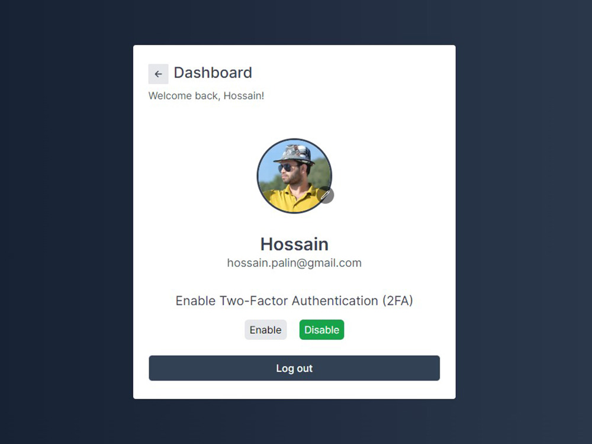

# login System

This project is a robust and secure login system built with modern web technologies. It offers a range of advanced features including two-factor authentication (2FA), password reset, email verification, and OAuth login. The system is designed to provide a seamless and secure user experience, leveraging the capabilities of Next.js, NextAuth, MongoDB, TypeScript, and TailwindCSS.

Fully responsive design optimized for desktops, tablets, and mobile devices. The application is built with a mobile-first approach to ensure a consistent user experience across all devices. The login system is designed to be user-friendly and intuitive, with clear instructions and error messages to guide users through the authentication process.

## Requirements

- Basic HTML, CSS & Javascript knowledge.
- Basic TypeScript knowledge.
- React JS & Next JS knowledge.
- Next-Auth knowledge.
- Basic MongoDB knowledge.
- Basic Tailwind CSS knowledge.

## How to Install & Run

To run the application, follow these steps:

1. Clone the repository or download it as a ZIP file.
2. In a terminal, navigate to the folder where the application is located.
3. Run the **npm install** command to install all the necessary dependencies.

```shell
npm install
```

4. Run the **npm run dev** command to start the application in development mode.

```shell
npm run dev
```

5. Open your browser and navigate to **http://localhost:3000** to use the application.

```shell
http://localhost:3000
```

## Application Features

This comprehensive login system leverages the power of modern web technologies to provide a secure and user-friendly authentication solution. It is designed to handle various authentication scenarios, ensuring both security and ease of use for end-users.

- Users can create accounts by providing necessary information such as name, email, and password.
- Passwords are securely hashed using bcrypt before storing them in the database.
- Validation for input fields to ensure data integrity and security.
- Users can log in using their email and password.
- Two-factor authentication (2FA) is available for enhanced security.
- Users can reset their passwords by requesting a password reset link via email.
- Email verification is required for new accounts to ensure the validity of email addresses.
- OAuth login is available for users who prefer to use their existing social media accounts.
- Users can log out of their accounts to end their session securely.
- Support for "Remember Me" functionality to keep users logged in across sessions.
- Users can enable or disable 2FA from their account settings.

## Technologies Used

This comprehensive login system leverages the power of modern web technologies to provide a secure and user-friendly authentication solution. It is designed to handle various authentication scenarios, ensuring both security and ease of use for end-users. With features like two-factor authentication, password reset, email verification, and OAuth login, it offers a complete package for any web application requiring robust authentication mechanisms.

- Next.js: A powerful React framework that provides server-side rendering, static site generation, and an intuitive file-based routing system.
- NextAuth: A complete authentication solution for Next.js applications, providing support for various authentication methods.
- MongoDB: A NoSQL database used to store user data, ensuring high performance and scalability.
- TypeScript: A statically typed superset of JavaScript that enhances code quality and maintainability.
- TailwindCSS: A utility-first CSS framework for rapidly building custom user interfaces.
- Bcrypt: A library used to securely hash passwords before storing them in the database.
- Resend: A module used to send emails for password reset and email verification.

## Contribution

If you'd like to contribute to this project, feel free to submit a pull request. Before doing so, be sure to create a separate branch for your changes.

## Buy A Coffee

Like my works and want to support me?

<a href="https://www.buymeacoffee.com/hossainpalin" target="_blank"></a>

## Screenshots




## Live demo

Live previews are the best way for a better understanding of the application's user interface.

[Click here...](https://login-system-palin.vercel.app)
